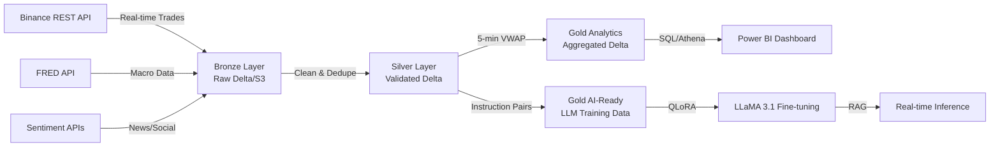

# 🚀 Crypto Market Analysis Platform

> **Production-grade data engineering project** implementing a Medallion Architecture on Databricks + AWS S3 for real-time cryptocurrency market analysis and AI-ready dataset generation.

[](https://python.org)
[](https://spark.apache.org)
[](https://delta.io)
[](https://databricks.com)
[](https://aws.amazon.com)

---

## 📊 Architecture



### Data Flow
```
Binance/FRED APIs → Bronze (Raw JSON/CSV) → Silver (Cleaned/Deduped) → Gold (Business Ready)
                                    ↓
                              Delta Lake on S3
                                    ↓
                    ┌───────────────┼───────────────┐
                    ↓               ↓               ↓
              Power BI/Athena   MLflow/QLoRA   Feature Store
```

---

## 🏗️ Medallion Architecture

| Layer | Purpose | Tech | Location |
|-------|---------|------|----------|
| **Bronze** | Raw ingestion, schema-on-read | REST API, Delta Lake | `s3://.../bronze/` |
| **Silver** | Deduplication, validation, type casting | Spark SQL, Window Functions | `s3://.../silver/` |
| **Gold** | Business aggregates + AI training pairs | Pandas UDFs, Delta Lake | `s3://.../gold/` |

---

## 🛠️ Tech Stack

- **Orchestration**: Databricks Workflows (Community Edition compatible)
- **Storage**: AWS S3 + Delta Lake
- **Processing**: Apache Spark 3.5 (Structured Streaming / Batch)
- **Catalog**: Hive Metastore (Community) → Unity Catalog (Enterprise)
- **Visualization**: Matplotlib, Plotly, Databricks SQL Dashboards
- **ML/AI**: MLflow, PEFT/QLoRA, LLaMA 3.1, RAG (enterprise phase)
- **Governance**: `.env` secret management, quality flags

---

## 📁 Project Structure

```
crypto-databricks-medallion/
├── README.md
├── requirements.txt
├── .env.example
├── config/
│   └── pipeline_config.yaml
├── notebooks/
│   ├── 00_setup.py              # S3 directory + .env creation
│   ├── 01_bronze_layer.py       # Binance + FRED ingestion
│   ├── 02_silver_layer.py       # Cleaning + technical indicators
│   ├── 03_gold_layer.py         # VWAP + AI-ready pairs
│   └── 04_visualization.py      # Dashboard + charts
└── assets/
    └── architecture_diagram.png
```

---

## 🚀 Quick Start

### 1. Prerequisites
- Databricks workspace (Community Edition works)
- AWS S3 bucket with write access
- Free FRED API key: [fred.stlouisfed.org](https://fred.stlouisfed.org/docs/api/api_key.html)

### 2. Setup
```bash
# Clone repo
git clone https://github.com/YOUR_USERNAME/crypto-databricks-medallion.git

# Install deps
pip install -r requirements.txt
```

### 3. Configure Secrets
Create `.env` in your S3 bucket (`s3://<bucket>/config/.env`):
```env
FRED_API_KEY=your_key_here
BINANCE_API_KEY=
HF_TOKEN=
```

### 4. Run Pipeline
Execute notebooks in order:
1. `00_setup.py` — Create S3 structure
2. `01_bronze_layer.py` — Ingest raw data
3. `02_silver_layer.py` — Clean & enrich
4. `03_gold_layer.py` — Aggregate & generate AI pairs
5. `04_visualization.py` — Dashboards

---

## 📈 Sample Outputs

### Bronze Layer
| id | price | qty | symbol | trade_timestamp |
|----|-------|-----|--------|-----------------|
| 12345678 | 64231.50 | 0.012 | BTCUSDT | 2026-08-26 02:15:00 |

### Gold VWAP
| symbol | window_start | vwap | volatility | buy_sell_ratio |
|--------|-------------|------|------------|----------------|
| BTCUSDT | 2026-08-26 02:00 | 64198.23 | 45.12 | 1.34 |

### AI-Ready Pair
**Instruction:**
> Analyze BTCUSDT market data: Current Price: $64231.50, 50-Trade SMA: $64150.00, Volatility: 0.0045, Fed Rate: 5.25%. Predict direction in next 10 trades.

**Response:**
> Technical Analysis: Price vs SMA: Above support, Volatility Regime: Normal, Macro Context: Fed rate at 5.25%. Prediction: UP with expected 0.85% movement.

---

## 🔐 Security

- All secrets stored in `.env` on S3 (never committed)
- No hardcoded API keys in notebooks
- Quality flags (`valid`/`suspicious`) on every trade
- Data validation filters invalid prices/quantities

---

## 🎯 Resume Impact

**What this project demonstrates:**
- ✅ **Data Engineering**: Medallion Architecture, Delta Lake, S3
- ✅ **Cloud Platforms**: Databricks, AWS, Spark
- ✅ **Real-time Ingestion**: REST API polling, incremental loads
- ✅ **Data Quality**: Deduplication, validation, window functions
- ✅ **Feature Engineering**: VWAP, volatility, SMA, momentum
- ✅ **AI/ML Pipeline**: Instruction-response generation for LLMs
- ✅ **Production Thinking**: Config-driven, secret management, idempotent writes

---

## 📝 License

MIT — free to use and modify.

---

## 🤝 Connect

Built for data engineering & MLOps portfolios. Questions? Open an issue!
